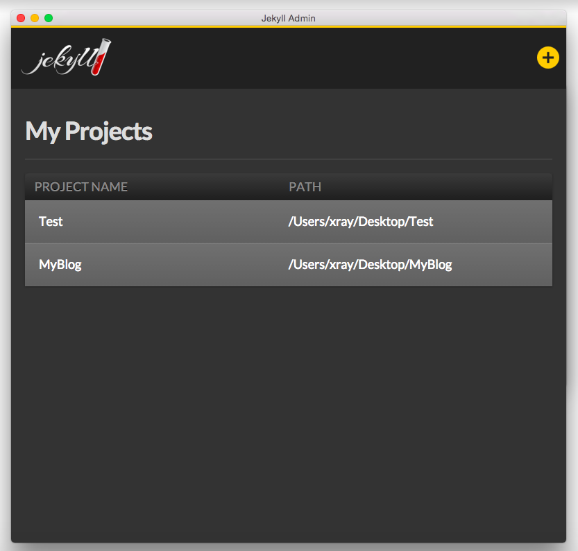
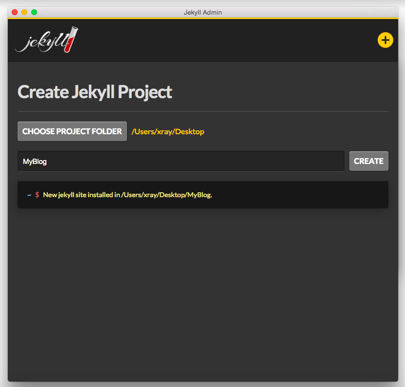
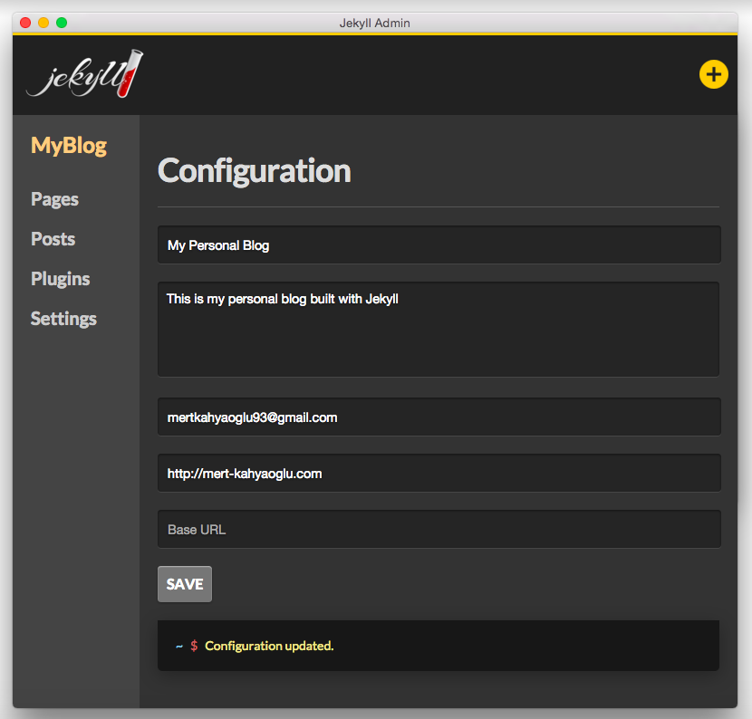

Jekyll Admin - Demo Application for GSoC
============

> Graphical user interface for Jekyll

# Screenshots

| Project List             | Create Project                      | Configuration               |
| ------------------------ | ----------------------------------- | --------------------------- |
| |  |  |

# Features
* Create Jekyll Projects
* List created projects
* Change project's configuration

# Built with

* [Electron](http://electron.atom.io/)
* [React.js](https://facebook.github.io/react/)
* [Redux](http://redux.js.org/)
* [Webpack](http://webpack.github.io/)

using [Electron+React Boilerplate](https://github.com/chentsulin/electron-react-boilerplate).

# Run

```bash
$ git clone https://github.com/mertkahyaoglu/jekyll-admin.git
$ cd jekyll-admin
$ npm install
$ npm run dev
```

# Download

You can download the demo application from [here](https://drive.google.com/open?id=0B9TuIgBV5IJSblVCME1zQXRJbm8)

## License

MIT © [Mert Kahyaoğlu](http://mert-kahyaoglu.com/) 2016
